# PlanIt

Your Ultimate Trip Planning Companion

---

## Project Overview

**PlanIt** is a personal trip planning companion app that empowers users to build, organize, and manage their future adventures. Designed for both solo and group travelers, PlanIt streamlines itinerary creation, hotel and attraction discovery, and integrates essential safety features to keep you secure throughout your journey.

---

## App Features

- **Trip Management**: Create, edit, and organize trips with detailed itineraries, dates, and destinations.
- **Hotel Search & Booking**: Find and book hotels tailored to your trip needs, powered by real-time data.
- **Attraction Discovery**: Explore and save nearby attractions for each trip location.
- **My Trips Dashboard**: View, manage, and revisit all your upcoming and past trips in one place.
- **Safety & Emergency Tools**:
  - **SOS Button**: Instantly send your location to emergency contacts and call local authorities.
  - **Emergency Contacts**: Add, manage, and quickly reach your trusted contacts.
  - **Safety Settings**: Centralized hub for all safety-related features.
- **User Profile**: Manage your personal information and preferences securely.
- **Modern, Intuitive UI**: Enjoy a clean, visually appealing interface with smooth navigation and interactive elements.

> 📸 **For a detailed look at each feature, see the screenshots below.**

---

## Screenshots

### Trip Flow
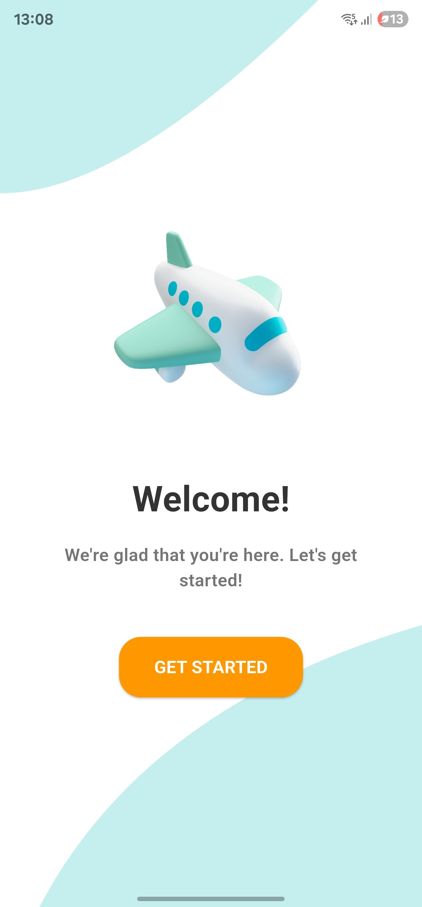
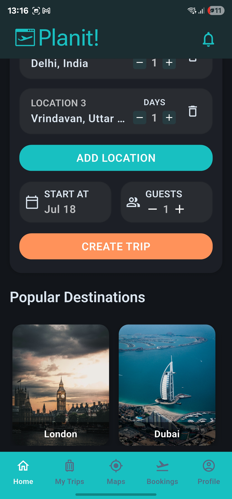
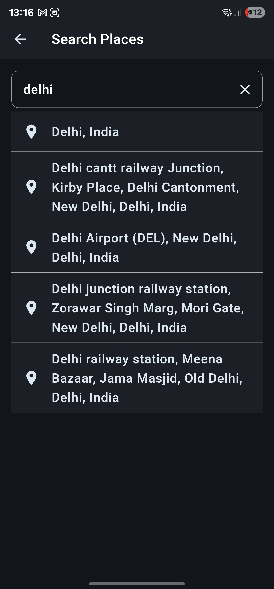
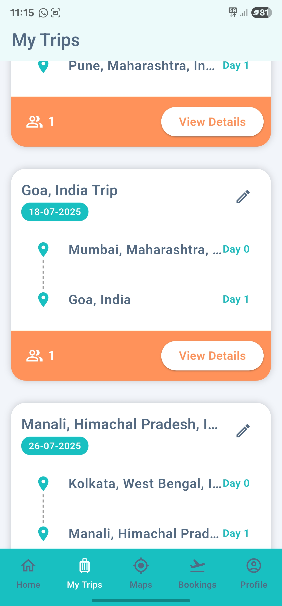

### Hotels & Attractions
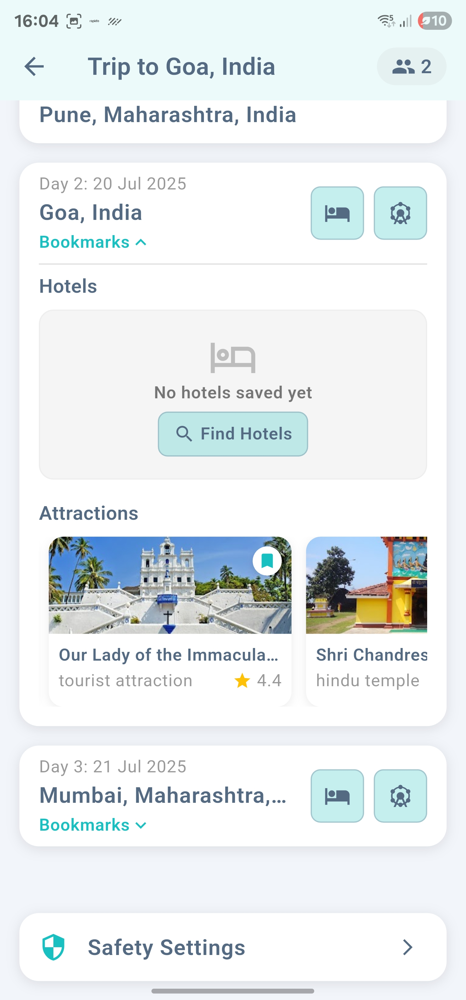
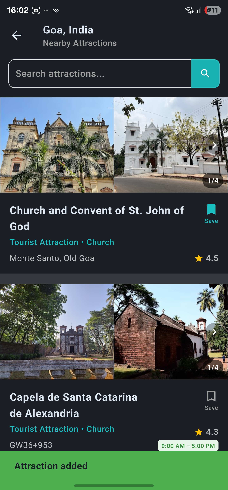
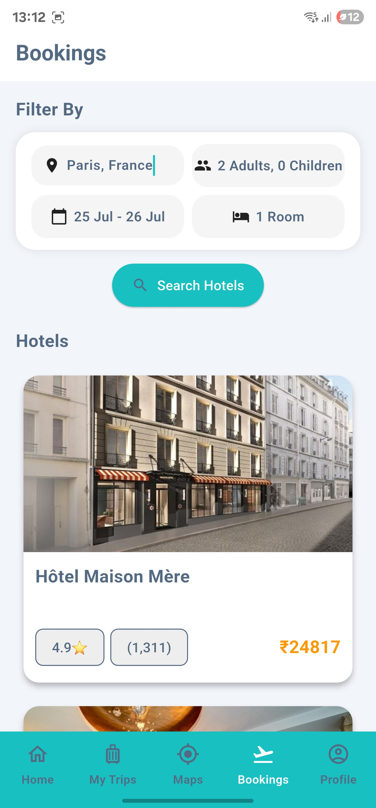

### Maps
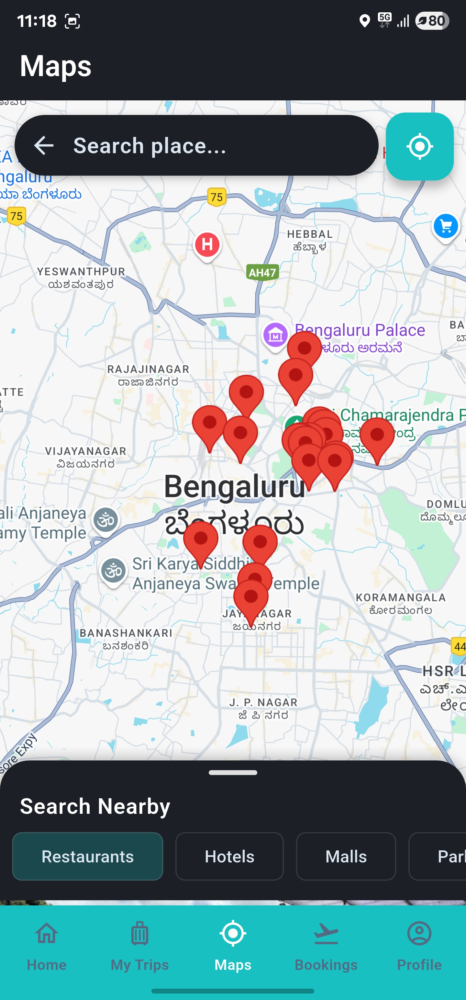
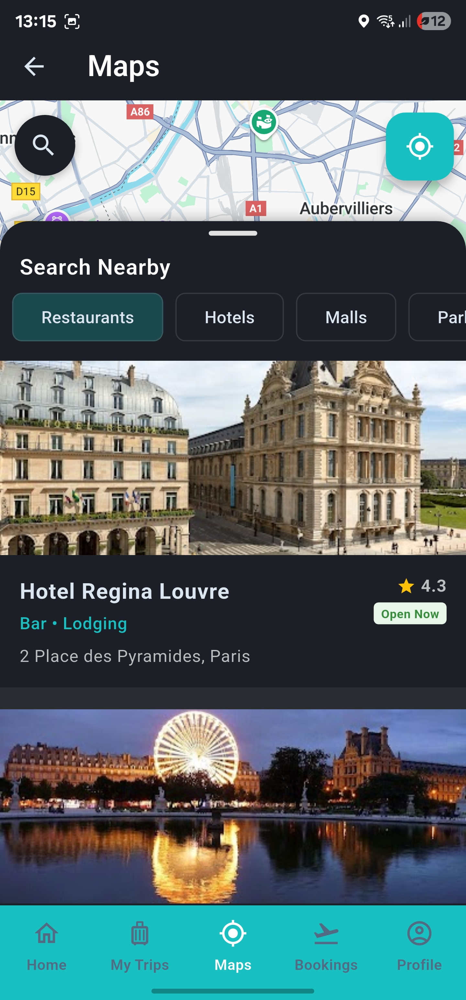

### Profile & Safety
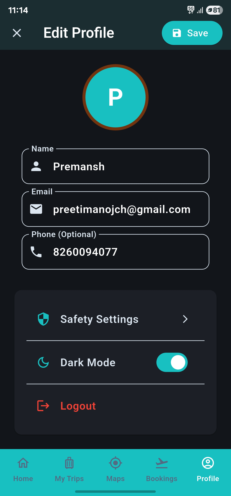
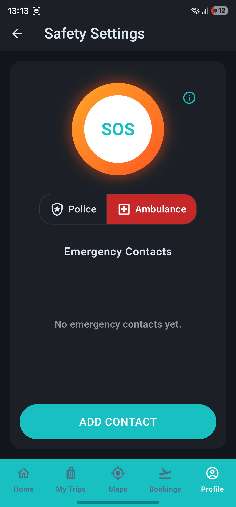

---

## Tech Stack

**Frontend:**
- **Flutter** (Dart)
  - State management: `provider`
  - UI: Material Design, custom widgets, `carousel_slider`
  - Maps: `google_maps_flutter`, `google_place`
  - Device features: `geolocator`, `telephony`, `flutter_phone_direct_caller`, `permission_handler`, `shared_preferences`
  - HTTP: `http`
  - Other: `intl`, `json_serializable`, `dotted_line`, `url_launcher`

**Backend:**
- **Node.js** (Express)
  - Database: MongoDB (via `mongoose`)
  - Auth: JWT (`jsonwebtoken`)
  - Validation: `joi`, `joi-phone-number`, `validator`
  - Email: `nodemailer`, `googleapis` (OAuth2 for Gmail)
  - Config: `config`, `dotenv`
  - Logging: `winston`
  - HTTP requests: `axios`

**Deployment:**
- Docker, Fly.io

---

## API Mentions

- **Google Places API**: Place search, autocomplete, and details (attractions, maps, etc.)
- **Google Maps API**: Map display and geolocation
- **Tripadvisor RapidAPI**: Hotel search and booking data
- **Device Telephony/SMS**: Emergency SMS and direct calling (via device permissions and plugins)
- **Gmail SMTP (OAuth2)**: Sending emails (password resets, notifications)

---

## Download

[Download PlanIt APK](https://limewire.com/d/UElzq#5q0PLAEtNJ)

> **Note:** To install PlanIt, you must temporarily disable Google Play Protect. Some of the app's advanced safety features require high-level permissions that may trigger Play Protect warnings. Please ensure you trust the source before proceeding.

---

## Future Plans

- **Group Collaborations**: Plan trips together with friends and family, share itineraries, and coordinate activities.
- **Transport Suggestions & Bookings**: Get recommendations and booking options for flights, trains, and other transport modes.

---

## Contact & Feedback

Have suggestions, feedback, or need support? Please open an issue or reach out via the repository.

---

## License

This project is for personal use. For licensing or usage inquiries, please contact the maintainer. 